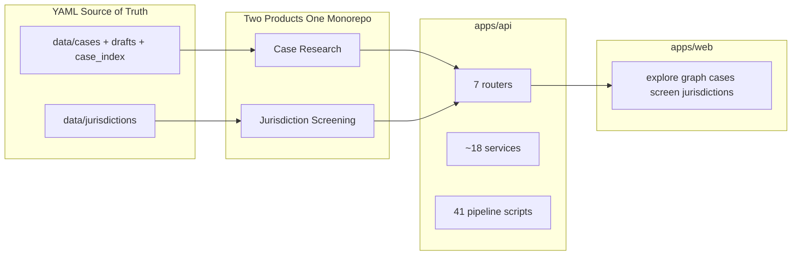
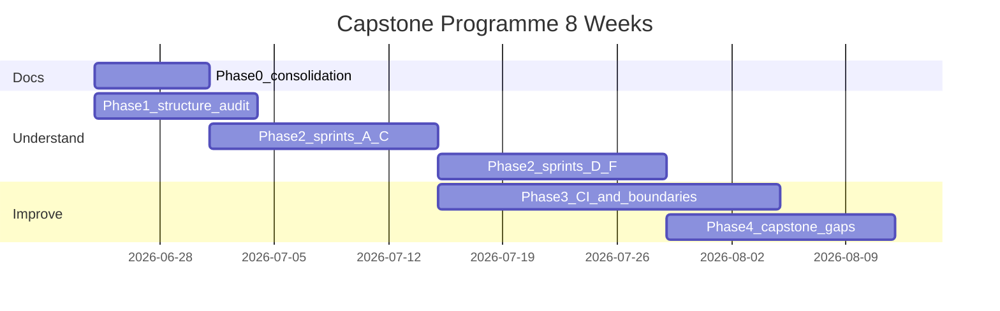

# CompMap Capstone Mastery Plan

## What you are optimising for

Three outcomes, in order:

1. **Defensible understanding** — you can explain why each major subsystem exists, what alternatives were rejected, and what would break if you changed it.
2. **Professional structure** — docs, directories, naming, and boundaries read like an intentional open-source project, not accumulated AI output.
3. **Working system aligned to goals** — two products (case research + jurisdiction screening) that scale cleanly and surface their reliability story.

This is **not** a big-bang refactor. It is an **audit → document → decide → change only what the audit proves wrong** loop. Code moves come after you can explain the current design.

---

## Current state (verified)



**What is already good (do not break):**
- YAML-as-source-of-truth with a hard draft/canonical wall ([`docs/ingestion-design.md`](docs/ingestion-design.md), [`promote_case_pipeline.py`](apps/api/scripts/promote_case_pipeline.py))
- Pydantic contracts as the spine ([`case.py`](apps/api/app/models/case.py), [`jurisdiction.py`](apps/api/app/models/jurisdiction.py))
- Tiered jurisdiction verification ([`run_jurisdiction_verification.py`](apps/api/scripts/run_jurisdiction_verification.py))
- Gold-fixture eval for extraction ([`data/evals/`](data/evals/))

**What hurts capstone credibility today:**
- [`README.md`](README.md) and [`v0-spec.md`](v0-spec.md) describe Neo4j + 5 cases; reality is Postgres/pgvector + 270+ cases + jurisdiction screening ([`CLAUDE.md`](CLAUDE.md) is the only accurate onboarding doc)
- 12 docs in [`docs/`](docs/) mix durable reference, sprint logs, and one-off preflight snapshots with conflicting case/jurisdiction counts
- Two products share one API and one [`lib/api.ts`](apps/web/src/lib/api.ts) but boundaries are implicit; overloaded vocabulary (`jurisdiction` means EU/UK/US on cases and `au`/`de`/`gb` on screening)
- CI runs ~29% of tests; documented pre-merge gates are manual ([`.github/workflows/api-ci.yml`](.github/workflows/api-ci.yml))

---

## Phase 0 — Documentation consolidation (week 1, low-hanging fruit)

### Target doc taxonomy

```
docs/
├── README.md              # index: what to read when (new)
├── architecture/          # durable system design
│   ├── overview.md        # two products, data flow, stores
│   ├── case-research.md   # pipeline, search, graph
│   └── jurisdiction-screening.md  # threshold engine, verification
├── operations/            # durable runbooks
│   ├── ingestion.md       # from ingestion-design.md (updated)
│   ├── promotion-checklist.md
│   └── jurisdiction-verification.md  # from jurisdiction-verification-build.md
├── data/                  # durable data contracts
│   └── source-integrity.md  # merge data-quality-notes + integrity rules
├── planning/              # ephemeral — safe to delete after shipped
│   └── (moved sprint, preflight, pipeline-assessment, product-plan)
└── archive/               # historical — never updated
    └── v0-spec.md (moved from root)
```

### File disposition

| Current file | Action |
|---|---|
| [`CLAUDE.md`](CLAUDE.md) | Keep at root for agents; slim to pointers into `docs/` |
| [`README.md`](README.md) | **Rewrite** as user-facing onboarding (Postgres stack, both products, real commands) |
| [`v0-spec.md`](v0-spec.md) | Move to `docs/archive/` |
| [`docs/ingestion-design.md`](docs/ingestion-design.md) | Move + fix stale "pipeline does not exist" header → `docs/operations/ingestion.md` |
| [`docs/human-promotion-checklist.md`](docs/human-promotion-checklist.md) | → `docs/operations/promotion-checklist.md` |
| [`docs/jurisdiction-verification-build.md`](docs/jurisdiction-verification-build.md) | → `docs/operations/jurisdiction-verification.md` |
| [`docs/data-quality-notes.md`](docs/data-quality-notes.md) | Merge into `docs/data/source-integrity.md` |
| [`docs/hard-case-*.md`](docs/) | Keep as `docs/operations/hard-cases.md` (durable workflow) |
| [`docs/sprint.md`](docs/sprint.md), [`controlled-expansion-preflight.md`](docs/controlled-expansion-preflight.md), [`pipeline-assessment.md`](docs/pipeline-assessment.md), [`jurisdiction-verification-baseline.md`](docs/jurisdiction-verification-baseline.md) | → `docs/planning/` or `docs/archive/` |
| [`docs/product-plan.md`](docs/product-plan.md) + [`project-pipeline-explainer.md`](docs/project-pipeline-explainer.md) | Merge into one `docs/planning/roadmap.md`; delete duplicates after |

### Deliverable for Phase 0

A **docs index** (`docs/README.md`) with three labels on every doc: `durable` | `planning` | `archive`. Rule: only `durable` docs are linked from README; planning docs have a `status: superseded` header when done.

**Exit criterion:** A new reader can onboard from README + `docs/architecture/overview.md` without hitting Neo4j or wrong case counts.

---

## Phase 1 — Repository structure audit (week 1–2)

Produce one durable artifact: **`docs/architecture/overview.md`** with a subsystem map you co-author (not AI-dumped). Structure each section as:

1. **What it does** (one paragraph)
2. **Key files** (with paths)
3. **Why this design** (chosen path)
4. **Alternatives considered** (e.g. Neo4j graph, DB-stored jurisdictions, monolithic router)
5. **Scale risks** (what breaks at 10× data or users)
6. **Open gaps**

### Subsystem inventory to walk through

**Shared platform**
- [`apps/api/main.py`](apps/api/main.py) — single FastAPI app, 7 routers
- [`apps/api/app/core/`](apps/api/app/core/) — config, pg_client (cases only), legacy neo4j_client
- [`apps/web/src/lib/api.ts`](apps/web/src/lib/api.ts) + [`types.ts`](apps/web/src/lib/types.ts) — monolithic API client

**Product 1: Case research**

| Layer | Location | Notes |
|---|---|---|
| Data | `data/cases/`, `drafts/`, `case_index/`, `source_text/` | Canonical vs indexed vs draft |
| Contracts | `app/models/case.py`, `case_index.py` | `CaseRecord` |
| Loaders | `app/loader/` | Cases only — jurisdictions load elsewhere |
| Services | `case_service`, `semantic_search_service`, `embedding_service`, `graph_*` | Postgres used here |
| Routes | `cases`, `indexed_cases`, `search`, `graph`, `graph_entities` | Two `/graph` routers |
| Pipeline | `scripts/extract_*`, `promote_*`, `validate_*`, `check_source_*` | 41 scripts, flat folder |
| Web | `/explore`, `/graph`, `/cases`, `/indexed-cases` | Home page is case-only |

**Product 2: Jurisdiction screening**

| Layer | Location | Notes |
|---|---|---|
| Data | `data/jurisdictions/*.yaml` + sidecars | ~60 profiles |
| Contracts | `app/models/jurisdiction.py` | `JurisdictionRule` |
| Engine | `app/services/threshold_engine.py` | Loads YAML inline (asymmetric with cases) |
| Verification | `jurisdiction_*` services (8 files) | Completeness, passages, staleness, regression |
| Routes | `jurisdictions.py` (748 lines) | Screening + 3 LLM endpoints in one file |
| Web | `/jurisdictions`, `/screen` | `ChatIntake.tsx` is largest UI file |

### Should the two products be in separate folders?

**Recommendation: keep the monorepo; strengthen boundaries in documentation and code layout — do not split repos yet.**

| Option | Pros | Cons | Verdict |
|---|---|---|---|
| **Status quo** (mixed routers/services) | Simple deploy, shared types | Hard to defend boundaries; naming collisions | Current state |
| **Monorepo + module boundaries** (recommended) | One deploy; clear ownership; capstone-friendly | Small refactor cost | **Do this** |
| **Two repos / two packages** | Hard isolation | Shared data contracts duplicated; overkill for capstone | Defer |

**Concrete boundary plan (later phases, not week 1):**

```
apps/api/app/
├── cases/          # routers + services + loaders for product 1
├── screening/      # threshold_engine + jurisdiction_* + jurisdictions router
└── shared/         # health, config, pg_client
```

```
apps/web/src/
├── features/cases/
├── features/screening/
└── lib/shared/
```

```
apps/api/scripts/
├── cases/          # extract, promote, validate
└── jurisdictions/  # verify_*, run_jurisdiction_verification
```

Data (`data/cases/` vs `data/jurisdictions/`) is **already cleanly split** — no change needed.

**Naming fixes to schedule** (document rationale before changing code):
- Rename case badge `Juris.tsx` → `CaseRegulatorBadge.tsx` (avoids collision with `/jurisdictions`)
- Home stat `jurisdiction_count` → `case_regulator_count` or split stats per product
- Add `data_jurisdictions_path` config key instead of deriving from `data_cases_path`

---

## Phase 2 — Deep-dive learning sprints (weeks 2–6)

Work product-by-product in **six 3–5 hour sessions**. Each session produces a short **Design Decision Record (DDR)** in `docs/architecture/decisions/` (ADR style: context, decision, consequences).

### Sprint A — Data contracts and source integrity
- Read [`CaseRecord`](apps/api/app/models/case.py) and [`JurisdictionRule`](apps/api/app/models/jurisdiction.py) field-by-field
- Trace one quote from PDF → draft → canonical → UI [`Evidence.tsx`](apps/web/src/components/Evidence.tsx)
- Run gates locally: `validate_cases.py`, `check_source_integrity.py`, `run_eval_benchmark.py --config ...ci.yaml`
- **DDR:** Why YAML not DB? Why verbatim quotes? Why `definition_status`?

### Sprint B — Extraction pipeline
- Follow [`extract_case_from_source.py`](apps/api/scripts/extract_case_from_source.py) → draft → [`review_draft.py`](apps/api/scripts/review_draft.py) → [`promote_case_pipeline.py`](apps/api/scripts/promote_case_pipeline.py)
- Understand multi-focus extraction ([`hard-case-diagnostics.md`](docs/hard-case-diagnostics.md))
- **DDR:** Deterministic-before-LLM ordering; draft wall

### Sprint C — Search and graph
- Keyword search (YAML in-memory) vs semantic ([`semantic_search_service.py`](apps/api/app/services/semantic_search_service.py) + pgvector migration)
- Graph: Neo4j optional fallback vs YAML-derived [`graph_entity_service.py`](apps/api/app/services/graph_entity_service.py)
- **DDR:** Why Postgres only for embeddings; when to retire Neo4j path

### Sprint D — Threshold engine
- Read [`threshold_engine.py`](apps/api/app/services/threshold_engine.py): `DealParameters`, `threshold_tests`, `screen_jurisdiction`
- Screen a deal via API and trace response to UI [`ScreenClient.tsx`](apps/web/src/app/screen/ScreenClient.tsx)
- **DDR:** Pure in-memory evaluation vs DB; test composition logic

### Sprint E — Jurisdiction verification programme
- Tier model: push / nightly / full ([`run_jurisdiction_verification.py`](apps/api/scripts/run_jurisdiction_verification.py))
- Gold deals ([`data/jurisdictions/_gold_deals.yaml`](data/jurisdictions/_gold_deals.yaml)) and UI badges ([`VerificationBadges.tsx`](apps/web/src/components/VerificationBadges.tsx))
- **DDR:** What "verified" means in product terms

### Sprint F — Deal-intake chat (LLM surface)
- [`ChatIntake.tsx`](apps/web/src/app/screen/ChatIntake.tsx) + `/jurisdictions/chat`, `parse-financials`
- **DDR:** This is orchestration, not agentic tools — what would tool/contract design look like if you added it?

**Exit criterion for Phase 2:** Six DDRs exist; you can whiteboard each flow without opening the repo.

---

## Phase 3 — Professional structure changes (weeks 4–8, surgical)

Only implement changes backed by Phase 1 audit. Priority order:

1. **Docs + README** (Phase 0) — highest ROI
2. **CI alignment** — make documented gates real:
   - Add `test_schema.py` + `validate_cases.py` to PR CI
   - Add `run_jurisdiction_verification.py --tier push` to PR CI
   - Add `npm run lint` + `npm run build` for web
3. **Router split** — break [`jurisdictions.py`](apps/api/app/routers/jurisdictions.py) into `screening.py` (POST screen) + `jurisdiction_chat.py` (LLM endpoints) + `jurisdictions.py` (GET CRUD)
4. **Frontend feature folders** — split `lib/api.ts` into `features/cases/api.ts` and `features/screening/api.ts`
5. **Script subdirs** — `scripts/cases/`, `scripts/jurisdictions/` (update imports in CI/docs)
6. **Legacy cleanup decision** — document Neo4j as deprecated; either remove or gate behind `NEO4J_ENABLED=false` default

**Explicitly defer** (not capstone-critical): auth/multi-tenancy, full observability stack, splitting into two repos.

---

## Phase 4 — Product gaps and scaling story (weeks 6–8)

Document in `docs/planning/roadmap.md` — then pick **2–3 gaps** to close for the capstone demo:

| Gap | Why it matters | Effort |
|---|---|---|
| README/onboarding drift | First impression for reviewers | Low (Phase 0) |
| `indexed-cases` vs `cases` confusion | User and code complexity | Medium — document intent or merge layers |
| Eval metrics invisible in UI | Reliability story hidden | Medium — admin/debug panel |
| Semantic search quality unevaluated | No embedding eval | Medium |
| `knowledge-chat` `include_cases` stub | Cross-product hook unused | Low doc or implement |
| Threshold engine unit tests | Only gold-deal regression | Low–medium |
| Branding: CompMap vs Meridian vs open-market | Portfolio coherence | Low — pick one name in docs |

**Capstone narrative:** "Legal research system with **source-grounded AI extraction**, **tiered verification**, and **deterministic screening** — not a chatbot wrapper."

---

## Seven skills mapping

| Skill | How this project demonstrates it | What to do in this plan |
|---|---|---|
| **1. System design** | YAML SoT, draft wall, tiered verification, derived pgvector | Phase 1 overview + DDRs |
| **2. Tool/contract design** | Pydantic schemas, CLI gates, gold fixtures, archetypes | Sprint A, E; optional: formalise screening as explicit tool API |
| **3. Code engineering** | FastAPI/Next monorepo, 34 test files, pipeline scripts | Phase 3 folder boundaries + CI |
| **4. Reliability engineering** | Promotion gate chain, eval benchmark, jurisdiction tiers | Sprint B, E; CI hardening |
| **5. Security & safety** | Quote grounding, no auto-promote, integrity checkers | Sprint A; document threat model for local research tool |
| **6. Eval & observability** | Gold YAML, F1 gating, regression deals; weak on metrics | Sprint B, E; add benchmark CI artifacts |
| **7. Product / UI/UX** | Verification badges, evidence UI, deal-intake chat | Sprint F; gap table |

**Agentic tool design:** Not required for capstone. The closest analogue is the **pipeline CLI + Pydantic contracts** — treat that as your "tool layer." If you want one stretch goal: define `screen_deal`, `fetch_jurisdiction`, `search_cases_semantic` as explicit tool schemas (JSON Schema) without building an agent runtime.

---

## Suggested weekly rhythm



**Per week:** 1 doc/audit session + 1 deep-dive sprint + 1 small structural fix (only if audit justified).

**Anti-pattern to avoid:** Asking the agent to "refactor for cleanliness" without a DDR explaining why.

---

## Capstone deliverables checklist

- [ ] Rewritten [`README.md`](README.md) + `docs/README.md` index
- [ ] `docs/architecture/overview.md` with subsystem map
- [ ] 6 DDRs in `docs/architecture/decisions/`
- [ ] Planning docs quarantined in `docs/planning/`
- [ ] CI runs schema validation + jurisdiction push tier + web build
- [ ] One recorded demo path: explore case → show evidence → screen deal → show verification tier
- [ ] One-page "defense sheet" — skills 1–7 with file pointers (for interviews)

---

## How we work together on this

When you start each phase, prompt with: **"Phase N, Session X — teach me [subsystem] and produce the DDR"** rather than **"implement/refactor X."** Implementation requests come only after the DDR is written and you've confirmed the decision.

First executable step when you approve: **Phase 0** — create `docs/` taxonomy, move/archive files, rewrite README from [`CLAUDE.md`](CLAUDE.md) truth, add `docs/README.md` index.
