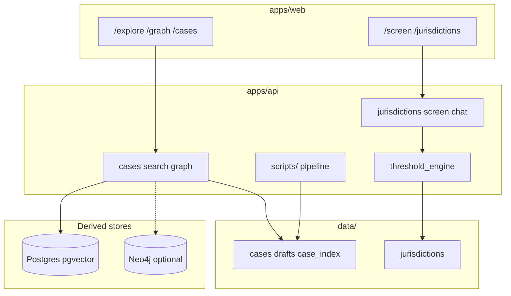

# Architecture overview

CompMap is a monorepo with two products sharing one FastAPI backend and one Next.js
frontend. **YAML under `data/` is the source of truth.** Postgres/pgvector is a derived
store for case semantic search only. Neo4j graph code is legacy and optional.



## Products

| Product | User-facing routes | Canonical data | Core logic |
|---------|-------------------|----------------|------------|
| **Case research** | `/explore`, `/graph`, `/cases`, `/indexed-cases` | `data/cases/`, `data/case_index/` | Loaders, semantic search, graph services |
| **Jurisdiction screening** | `/jurisdictions`, `/screen` | `data/jurisdictions/` | `threshold_engine.py`, verification services |

## Layering (backend)

```
routers/  →  services/  →  loader/ (cases) | threshold_engine (jurisdictions)
                ↓
           models/ (Pydantic contracts)
                ↓
           data/*.yaml
```

## Naming caveat

`jurisdiction` is overloaded:

- On **cases**: regulator bucket (`EU`, `UK`, `US`)
- On **screening**: country/regime id (`au`, `de`, `gb`, `eu`, …)

## Key boundaries

- **Draft vs canonical:** AI writes `data/drafts/` only; `promote_case_pipeline.py` is the only promotion path.
- **Indexed vs canonical cases:** `case_index/` is lighter metadata; `cases/` is fully reviewed records.
- **Screening has no DB:** threshold evaluation is in-memory over YAML.

## Further reading

- [case-research.md](case-research.md)
- [jurisdiction-screening.md](jurisdiction-screening.md)
- [operations/ingestion.md](../operations/ingestion.md)
- [operations/jurisdiction-verification.md](../operations/jurisdiction-verification.md)
