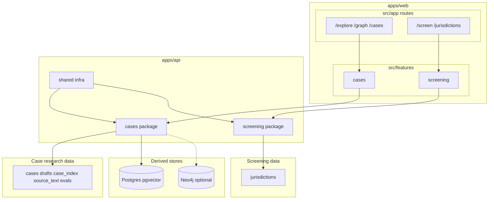

# Architecture overview

Meridian is a monorepo (`open-market`) with two products sharing one FastAPI backend
(`apps/api`) and one Next.js frontend (`apps/web`). **YAML under `data/` is the source
of truth.** Postgres/pgvector is a derived store for case semantic search only. Neo4j
graph code is legacy and optional.



## Products

| Product | User-facing routes | Primary data | Core logic |
|---------|-------------------|--------------|------------|
| **Case research** | `/explore`, `/graph`, `/cases`, `/indexed-cases` | See [case research blob](#case-research-blob) | Loaders, semantic search, graph services |
| **Jurisdiction screening** | `/jurisdictions`, `/screen` | See [screening blob](#screening-blob) | `threshold_engine.py`, verification services |

## Data layout

Top-level `data/` folders are **not** nested under two parents — paths stay stable.
Group them mentally (and in code ownership) as two blobs:

### Case research blob

| Path | Role |
|------|------|
| `data/cases/` | Canonical reviewed `CaseRecord` YAML |
| `data/drafts/` | AI extraction output — **never auto-promoted** |
| `data/case_index/` | Lighter discovery metadata (`CaseIndexEntry`) |
| `data/source_text/` | Cached PDF text for quote integrity checks |
| `data/concepts/` | Shared concept nodes for graph views |
| `data/evals/` | Gold fixtures and extraction benchmarks |
| `data/pipeline_profiles/` | Per-jurisdiction/doc-type extraction config |
| `data/pipeline_rules/` | Pipeline rule helpers |
| `data/review_learning/` | Human correction deltas from promotion |
| `data/batch_runs/` | Batch extraction run metadata |

**Critical boundary:** `drafts/` → human review → `cases/` via `scripts/cases/promote_case_pipeline.py` only.

### Screening blob

| Path | Role |
|------|------|
| `data/jurisdictions/*.yaml` | Threshold profiles (`JurisdictionRule`) |
| `data/jurisdictions/_schema.md` | Field reference |
| `data/jurisdictions/_archetypes.yaml` | Completeness rules by regime type |
| `data/jurisdictions/_gold_deals.yaml` | Regression deals for threshold engine |

Screening reads YAML in memory — no database table for jurisdiction data.

## Code layout

```
apps/api/app/
  shared/       # core/config, pg_client, health, pdf_extractor
  cases/        # models, routers, services, loader
  screening/    # models, routers, services

apps/api/scripts/
  cases/        # extraction, promotion, validation, embed
  screening/    # jurisdiction verification

apps/web/src/
  app/          # Next.js routes (thin wrappers)
  features/
    cases/      # explore, graph modules; case components; api.ts
    screening/  # screen, jurisdiction UI; api.ts
  components/   # shared chrome (NavBar, Badge, ThemeToggle, …)
  lib/          # api-client.ts, types.ts, utils.ts
```

## Layering (backend)

```
app/cases/routers → app/cases/services → app/cases/loader → data/cases/
app/screening/routers → app/screening/services → data/jurisdictions/
app/shared/ — config, pg_client, health, pdf_extractor only
```

Domain models live in product packages (`app/cases/models/`, `app/screening/models/`), not in `shared/`.

## Naming caveat

`jurisdiction` is overloaded:

- On **cases**: regulator bucket (`EU`, `UK`, `US`)
- On **screening**: country/regime id (`au`, `de`, `gb`, `eu`, …)

## Key boundaries

- **Draft vs canonical:** AI writes `data/drafts/` only.
- **Indexed vs canonical cases:** `case_index/` is discovery metadata; `cases/` is fully reviewed records.
- **Screening has no DB:** threshold evaluation is in-memory over YAML.
- **Shared code:** infra only — not domain models or business rules.

## Further reading

- [case-research.md](case-research.md)
- [jurisdiction-screening.md](jurisdiction-screening.md)
- [specs/completed/2026-06-24-restructure-layout.md](../specs/completed/2026-06-24-restructure-layout.md)
- [operations/ingestion.md](../operations/ingestion.md)
- [operations/jurisdiction-verification.md](../operations/jurisdiction-verification.md)
