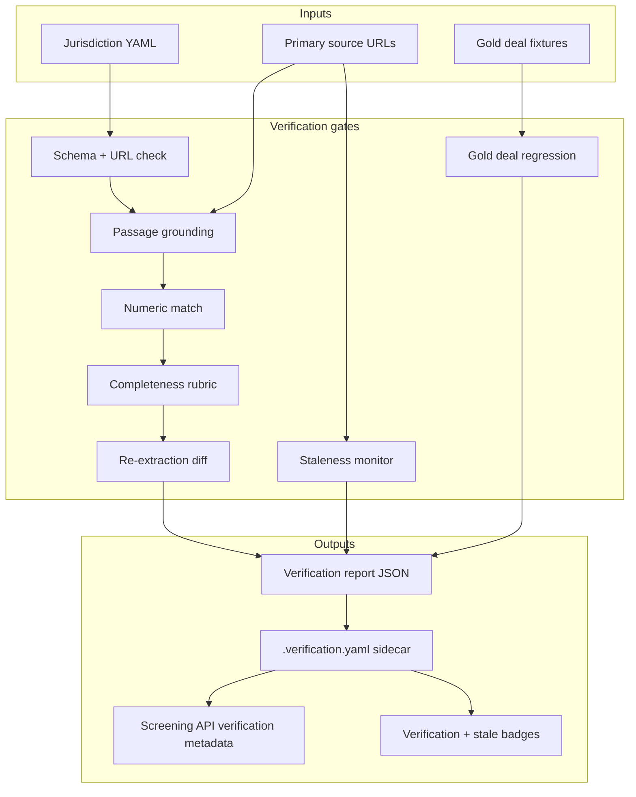

# Jurisdiction verification

Reference for the automated jurisdiction profile verification programme. Profiles
live in `data/jurisdictions/*.yaml`; verification is orchestrated by
`apps/api/scripts/screening/run_jurisdiction_verification.py` (tiers: `push`, `nightly`, `full`).

---

## Purpose

CompMap maintains ~60 jurisdiction YAML profiles covering merger control thresholds,
regime flags, review periods, gun-jumping, FDI screening, and practitioner nuance.
Before lawyers rely on screening results for first-instance transaction review, each
profile must be **machine-verified against authoritative sources** — grounded with
explicit source-verification tiers, not assumed accurate from research alone.

---

## Current state (post-commit baseline)

### What exists today

| Layer | Status |
|-------|--------|
| **Schema** | Rich Pydantic model in `apps/api/app/models/jurisdiction.py`; spec in `data/jurisdictions/_schema.md` |
| **Data** | 47 jurisdiction YAMLs with thresholds, `source_passages`, `minority_thresholds`, practitioner notes |
| **Screening** | `threshold_engine.py` evaluates deals; `/jurisdictions/screen` returns status + legal citations |
| **URL check** | `apps/api/scripts/screening/verify_jurisdiction_urls.py` — async link checker (live links ≠ accurate content) |
| **Maintenance** | `fix_jurisdiction_redirects.py`, `insert_minority_thresholds.py` |
| **UI** | Chat intake (`/screen`), jurisdiction detail pages, `last_verified` dates |

### Baseline data coverage snapshot

Measured locally on 2026-06-20:

| Metric | Count |
|--------|-------|
| Jurisdiction YAML profiles | 47 |
| Threshold conditions | 163 |
| Conditions with `source_type: primary_legislation` | 119 |
| Conditions with direct `source_url` | 17 |
| `source_passages[]` entries | 60 |
| Condition IDs supported by passages | 103 |
| Primary-legislation conditions missing passage support | 46 |
| Jurisdictions with no `source_passages` | 10 |
| Annual-adjustment threshold tests | 12 |

Jurisdictions currently lacking `source_passages`: `cl`, `cz`, `dk`, `gr`, `hu`, `id`, `pe`, `ph`, `pt`, `ro`.

This means v1 is partly an automation build and partly a data-remediation programme. The verification gates are expected to fail many profiles initially; that is useful output, not implementation failure.

### What is missing

| Gap | Risk |
|-----|------|
| Quote grounding | Agent may have paraphrased or hallucinated statutory text |
| Numeric verification | Threshold values may not match the cited provision |
| Completeness | Missing tests, exclusions, or archetype-specific fields |
| Logic correctness | Engine may mis-evaluate even with correct YAML |
| Staleness | Annual-adjustment jurisdictions (e.g. US HSR) drift without detection |
| Confidence surfacing | UI treats all fields as equally reliable |
| Confidence semantics | Existing `confidence` means deal-input sufficiency / close-call risk, not legal-source reliability |

### Precedent in this repo

The case ingestion pipeline already solves a similar problem:

- `repair_source_passages.py` — grounds quotes in PDF text
- Quote validation gate — rejects passages not found in source
- Gold fixtures — `data/evals/gold/` for regression
- Review status + confidence on every field

**This build ports that pattern to jurisdiction YAML.**

---

## Quality model

### Three separate signals

Do **not** overload the existing screening `confidence` field. Today `confidence` is calculated in `threshold_engine.py` from missing deal inputs and close-call thresholds. It should remain transaction-specific, or be renamed to `screening_confidence`.

The build adds three separate legal-data signals:

| Signal | Meaning | Where surfaced |
|--------|---------|----------------|
| `source_verification_tier` | Whether YAML facts are grounded in authoritative source text | Sidecar, API, UI badges |
| `regression_status` | Whether known deal fixtures produce expected screening results | Sidecar, CI |
| `freshness_status` | Whether annual-adjustment and recently updated regimes are current | Sidecar, UI stale badge |

Product rule: a result may still have `screening_confidence: high` because the transaction inputs are complete and not close to thresholds, but the UI must separately show if `source_verification_tier < 2` or `freshness_status != fresh`.

### Source verification tiers

Every jurisdiction profile, and eventually every hard-fact field, carries a source-verification tier.

| Tier | Name | Meaning | Automated gate |
|------|------|---------|----------------|
| 0 | `schema_valid` | Pydantic load passes; URLs are present/live or explicitly unreachable/bot-protected | Existing schema + `verify_jurisdiction_urls.py` |
| 1 | `passages_grounded` | Hard-fact source passages are found verbatim or near-verbatim in linked authoritative sources | `verify_jurisdiction_passages.py` |
| 2 | `numbers_confirmed` | Extracted numbers/dates/currencies from grounded passages match YAML values | Same script, numeric/date pass |
| 3 | `structure_complete` | Archetype checklist satisfied; hard-fact condition↔passage linkage enforced | `verify_jurisdiction_completeness.py` |
| 4 | `cross_checked` | Independent re-extraction agrees on hard-fact numeric conditions | `verify_jurisdiction_reextract.py` |

Regression and freshness are intentionally not higher tiers. They can change independently from source grounding.

### Regression status

| Status | Meaning | Automated gate |
|--------|---------|----------------|
| `not_run` | No gold deal suite exists for this jurisdiction/archetype | Default |
| `passed` | Gold deal fixtures pass against current engine + YAML | `test_jurisdiction_regression.py` |
| `failed` | At least one fixture result differs from expected | `test_jurisdiction_regression.py` |

### Freshness status

| Status | Meaning | Automated gate |
|--------|---------|----------------|
| `fresh` | Last source check is within policy window and annual-adjustment anchors match | `monitor_jurisdiction_staleness.py` |
| `stale` | Last source check exceeds policy window, but no contrary value detected | `monitor_jurisdiction_staleness.py` |
| `drift_detected` | Official anchor values differ from YAML | `monitor_jurisdiction_staleness.py` |
| `unknown` | Source unavailable, bot-protected, or no anchor configured | `monitor_jurisdiction_staleness.py` |

### Field classes

Not all fields need the same tier to be useful:

| Class | Examples | Required source tier for legal-data confidence |
|-------|----------|---------------------------------------------|
| **Hard facts** | Threshold numbers, mandatory/suspensory flags, phase days | Tier 2+ |
| **Structured nuance** | Exclusions, minority threshold rules with citations | Tier 1+ |
| **Practitioner synthesis** | Control threshold narrative, CMA discretion notes | Tier 0; show as guidance only |

Hard facts drive screening results. Synthesis fields are displayed as guidance and cannot raise `source_verification_tier`. Practitioner-sourced hard facts remain low-tier unless replaced or independently backed by official source text.

---

## Architecture



### Sidecar file convention

Verification metadata lives in a sidecar to avoid polluting hand-edited YAML:

```
data/jurisdictions/uk.yaml
data/jurisdictions/uk.verification.yaml   ← generated by gates, committed after pass
```

```yaml
# uk.verification.yaml (example)
jurisdiction_id: uk
verified_at: "2026-06-20T14:00:00Z"
source_verification_tier: 3
source_tier_breakdown:
  passages_grounded: pass
  numbers_confirmed: pass
  structure_complete: pass
  cross_checked: pass
regression_status: not_run
freshness_status: fresh
freshness:
  checked_at: "2026-06-20T14:00:00Z"
  policy_window_days: 180
  anchors_checked: []
failures: []
conditions_verified:
  uk_turnover_target:
    tier: 2
    passage_id: uk_ea2002_s23_1
    numeric_match: true
    source_type: primary_legislation
```

Sidecars are read by the jurisdiction loader/API layer and included in screening responses as verification metadata. The existing screening `confidence` field should not be silently capped; expose legal-source reliability separately as `source_verification_tier`, `regression_status`, and `freshness_status`.

### Loader boundary

Do not bolt sidecar parsing directly into every endpoint. Add a small jurisdiction data service/loader that returns:

- `JurisdictionRule`
- optional `JurisdictionVerification`
- helper methods for condition-level verification lookups

`threshold_engine.py` should remain focused on evaluating deal parameters against rules. The API serializer can combine engine output with sidecar metadata.

### Archetype templates

Completeness is checked against jurisdiction archetypes defined in:

```
data/jurisdictions/_archetypes.yaml
```

| Archetype | Jurisdictions | Required elements |
|-----------|---------------|-------------------|
| `eu_turnover` | eu | 2 tests, two-thirds exclusion, Article 7 gun-jumping |
| `us_hsr_two_tier` | us_hsr | standard + large transaction tests, annual_adjustment |
| `voluntary_slc` | uk | turnover + share-of-supply tests, voluntary regime flag |
| `mandatory_turnover` | de, fr, it, … | mandatory + suspensory, domestic/worldwide conditions |
| `market_share_trigger` | br, … | share-based conditions |
| `fdi_parallel` | uk, eu, … | fdi_screening section when applicable |

Archetypes are config, not code — easy to extend without redeploying gates.

---

## Source fetcher design

Shared library: `apps/api/app/services/source_fetcher.py`

| Source | Strategy |
|--------|----------|
| eur-lex.europa.eu | HTML fetch; extract `#TexteOnly` or article div |
| legislation.gov.uk | HTML fetch; extract section content |
| uscode.house.gov | HTML fetch; extract section text |
| ecfr.gov | HTML fetch; extract § text |
| ftc.gov press releases | HTML/PDF for annual threshold notices |
| Official PDFs / gazettes | Download/extract text using `app.utils.pdf_extractor` cache pattern |
| Non-English official pages | Normalize text; record `language` when available; accept official English translations separately |
| Bot-protected sites | Mark `fetch_status: bot_protected`; skip numeric check, flag tier 0 |

Normalization pipeline:

1. Strip HTML tags and entities
2. Collapse whitespace
3. Unicode normalize (NFKC)
4. Fuzzy match threshold: exact first, then normalized substring (≥95% token overlap)

Reuse patterns from `repair_source_passages.py` and `app.utils.pdf_extractor` where applicable. Do not build an HTML-only verifier; many jurisdiction sources are PDFs, official gazettes, and authority threshold notices.

Fetcher output should include:

```yaml
url: "https://..."
final_url: "https://..."
content_type: "text/html"
fetch_status: ok              # ok | broken | bot_protected | ssl_uncertain | unsupported
text: "normalized source text"
retrieved_at: "2026-06-20T14:00:00Z"
```

---

## Gate specifications

### Gate 1: `verify_jurisdiction_passages.py`

**Purpose:** Prove quoted authoritative text exists at the linked URL; prove hard-fact values match.

**Checks per `source_passages[]` entry:**
- Fetch `document_url`
- Assert `quoted_text` found (normalized)
- For each `supports_conditions[]` ID, find matching condition in `threshold_tests`
- Extract numbers/currency from quote; compare to `condition.value` and `condition.currency`
- Extract dates and percentages where relevant; compare to `effective_date`, review periods, fines, and market-share thresholds where linked
- Fail if a hard-fact condition from an authoritative source type has no supporting passage

Authoritative source types for hard-fact gates:

- `primary_legislation`
- `official_guidance`
- `authority_announcement`

`practitioner` can support display guidance and gap triage, but cannot satisfy tier 1/2 for hard facts without an accepted exception in the sidecar.

**Output:** JSON report + update sidecar. Exit 1 if any hard failure.

**CLI:**
```bash
python apps/api/scripts/screening/verify_jurisdiction_passages.py [--jurisdiction uk] [--fix] [--verbose]
```

**Tests:** Fixture HTML/PDF text snippets for EU Art 1(2), UK s.23, US HSR threshold notices/§801 — no live network in CI.

---

### Gate 2: `verify_jurisdiction_completeness.py`

**Purpose:** Structural completeness without fetching law.

**Checks:**
- Every hard-fact authoritative-source condition has `source_url` or linked passage
- Every `threshold_tests[]` has `legal_basis` + `source_url`
- `annual_adjustment: true` → `effective_date` present
- Regime consistency: `mandatory: true` + `suspensory: true` → `gun_jumping` section exists
- Archetype checklist for jurisdiction's assigned archetype(s)
- No duplicate `condition_id` or `test_id`
- `practitioner` source_type requires `note` explaining why
- `source_passages[].supports_conditions[]` references existing condition IDs
- Conditions used by scope pre-filtering, especially `minority_thresholds`, have citation/source coverage appropriate to their effect on screening

**CLI:**
```bash
python apps/api/scripts/screening/verify_jurisdiction_completeness.py [--jurisdiction all]
```

---

### Gate 3: `verify_jurisdiction_reextract.py`

**Purpose:** Independent extraction cross-check.

**Flow:**
1. For each jurisdiction, collect all `source_url` / `document_url` from authoritative hard-fact conditions
2. Run structured extraction (Gemini with strict JSON schema): thresholds only, no prose
3. Diff against existing YAML numerics (value, operator, party, scope)
4. Report mismatches; do not auto-write YAML

**Promotion rule:** Tier 4 requires zero unresolved mismatches (or explicit `accepted_drift` entry in sidecar with reason).

---

### Gate 4: Gold deal regression suite

**Purpose:** Behavioral correctness of screening engine + YAML logic.

**Data:** `data/jurisdictions/_gold_deals.yaml`

```yaml
deals:
  - deal_id: eu_below_threshold_2019
    description: "Public deal confirmed no EU notification required"
    jurisdictions: [eu]
    expected:
      eu: not_triggered
    deal:
      acquirer: { worldwide: 3_000_000_000, eu_eea: 200_000_000 }
      target: { worldwide: 500_000_000, eu_eea: 100_000_000 }
    source_url: "https://..."
```

**Target:** Minimum 3 deals per major archetype (EU, US HSR, UK, DE, FR) = ~15 deals for v1.

**Test:** `apps/api/tests/test_jurisdiction_regression.py` — parametrize over gold deals.

---

### Gate 5: `monitor_jurisdiction_staleness.py`

**Purpose:** Detect drift in annual-adjustment jurisdictions.

**For each YAML with `annual_adjustment: true`:**
- Fetch canonical anchor (FTC notice, official gazette, etc.)
- Extract current threshold values
- Compare to YAML
- If mismatch: set `staleness: detected` in sidecar, optionally open GitHub issue

**Schedule:** Weekly CI cron + manual pre-release run.

---

## PR plan

Branches follow `jurisdiction-verification/<slug>`. Each PR is one reviewable unit. Merge sequentially — later PRs depend on earlier ones.

### PR 1 — Scaffolding & verification model
**Branch:** `jurisdiction-verification/scaffolding`  
**Size:** ~500 lines  
**Review focus:** Data model, sidecar format, archetype config, baseline gap reporting

| Deliverable | Path |
|-------------|------|
| Verification tier enums + sidecar Pydantic models | `apps/api/app/models/jurisdiction_verification.py` |
| Archetype templates | `data/jurisdictions/_archetypes.yaml` |
| Sidecar schema doc | `data/jurisdictions/_verification_schema.md` |
| Baseline coverage report script | `apps/api/scripts/screening/report_jurisdiction_verification_baseline.py` |
| Baseline report snapshot | `docs/jurisdiction-verification-baseline.md` |
| Stub CLI entrypoints (no logic yet) | `apps/api/scripts/screening/verify_jurisdiction_passages.py` (skeleton) |
| Unit tests for model load | `apps/api/tests/test_jurisdiction_verification_model.py` |

**Acceptance:** Models load; archetypes validate; stubs run `--help`; baseline report reproduces counts for conditions, source passages, missing passage support, and annual-adjustment tests.

---

### PR 2 — Source fetcher library
**Branch:** `jurisdiction-verification/source-fetcher`  
**Size:** ~650 lines  
**Review focus:** Fetch reliability, text normalization, offline fixtures

| Deliverable | Path |
|-------------|------|
| Fetch + normalize service | `apps/api/app/services/source_fetcher.py` |
| HTML/PDF text fixture files for CI | `apps/api/tests/fixtures/jurisdiction_sources/` |
| Unit tests (offline) | `apps/api/tests/test_source_fetcher.py` |

**Acceptance:** Fixtures normalize and match expected text; PDF/text cache path works offline; live fetch works for eur-lex + legislation.gov.uk in manual smoke test.

---

### PR 3 — Passage grounding gate
**Branch:** `jurisdiction-verification/passage-gate`  
**Size:** ~750 lines  
**Review focus:** Quote matching logic, numeric extraction, failure reporting

| Deliverable | Path |
|-------------|------|
| Full implementation | `apps/api/scripts/screening/verify_jurisdiction_passages.py` |
| Numeric extraction helpers | `apps/api/app/services/jurisdiction_numeric.py` |
| Tests with fixtures | `apps/api/tests/test_verify_jurisdiction_passages.py` |

**Acceptance:** Runs against EU, UK, US HSR fixtures offline; produces sidecar with source tier 1–2 status; exit code reflects pass/fail.

**Note:** First PR that should be run against real YAML data. Expect failures — that's the point.

---

### PR 4 — Completeness & linkage gate
**Branch:** `jurisdiction-verification/completeness-gate`  
**Size:** ~450 lines  
**Review focus:** Archetype rules, linkage invariants

| Deliverable | Path |
|-------------|------|
| Completeness verifier | `apps/api/scripts/screening/verify_jurisdiction_completeness.py` |
| Tests | `apps/api/tests/test_verify_jurisdiction_completeness.py` |

**Acceptance:** All 47 YAMLs run; report lists missing elements per archetype; source tier 3 computed in sidecar.

---

### PR 5 — Cross-check & gold deal regression
**Branch:** `jurisdiction-verification/regression-suite`  
**Size:** ~700 lines  
**Review focus:** Gold deal selection, regression test design

| Deliverable | Path |
|-------------|------|
| Re-extraction diff script | `apps/api/scripts/screening/verify_jurisdiction_reextract.py` |
| Gold deal fixtures (v1) | `data/jurisdictions/_gold_deals.yaml` |
| Regression tests | `apps/api/tests/test_jurisdiction_regression.py` |

**Acceptance:** ≥15 gold deals; regression tests pass on current engine; re-extract produces diff report for EU + US HSR.

**Note:** Gold deals are the highest-leverage manual curation step in the entire build (~2 hours of research). Everything else is automated.

---

### PR 6 — Staleness monitor
**Branch:** `jurisdiction-verification/staleness-monitor`  
**Size:** ~300 lines  
**Review focus:** Anchor source mapping, drift detection

| Deliverable | Path |
|-------------|------|
| Staleness script | `apps/api/scripts/screening/monitor_jurisdiction_staleness.py` |
| Anchor config | `data/jurisdictions/_staleness_anchors.yaml` |
| Tests with mocked anchors | `apps/api/tests/test_monitor_jurisdiction_staleness.py` |

**Acceptance:** Detects injected drift in test fixture; US HSR anchor maps to FTC notice URL.

---

### PR 7 — Product integration (API + UI)
**Branch:** `jurisdiction-verification/product-integration`  
**Size:** ~500 lines  
**Review focus:** Verification metadata, confidence semantics, UX clarity

| Deliverable | Path |
|-------------|------|
| Jurisdiction data loader/service reads YAML + sidecar | `apps/api/app/services/jurisdiction_data_service.py` |
| Verification metadata in screening API | `apps/api/app/routers/jurisdictions.py` |
| Staleness/verification badges | `apps/web/src/app/screen/ScreenClient.tsx`, `jurisdictions/[id]/page.tsx` |
| TypeScript types | `apps/web/src/lib/types.ts` |
| Fix jurisdiction detail "Last updated" to use `rule.last_verified` | `apps/web/src/app/jurisdictions/[id]/page.tsx` |

**Acceptance:** Screening results show `source_verification_tier`, `regression_status`, and `freshness_status`; stale jurisdictions show yellow badge; low-tier nuance fields labeled as guidance; existing `confidence` is either renamed to `screening_confidence` or clearly documented as transaction-input confidence.

---

### PR 8 — CI pipeline
**Branch:** `jurisdiction-verification/ci`  
**Size:** ~150 lines  
**Review focus:** What runs on every push vs nightly

| Deliverable | Path |
|-------------|------|
| GitHub Actions workflow | `.github/workflows/jurisdiction-verification.yml` |
| Orchestrator script | `apps/api/scripts/screening/run_jurisdiction_verification.py` |

**CI tiers:**

| Trigger | Gates |
|---------|-------|
| Every push | Schema + completeness (offline) + gold deal regression |
| Nightly cron | Passage grounding (live fetch, subset) + staleness monitor |
| Manual / pre-release | Full 47-jurisdiction passage gate |

**Acceptance:** CI green on main; nightly job documented in workflow comments.

---

### Optional PR 9 (post-v1) — Adversarial agent loop

**Branch:** `jurisdiction-verification/adversarial-loop`  
Defer until PRs 1–8 ship. Automated red-team: proponent/skeptic/arbiter agents. Only needed for jurisdictions that fail gates repeatedly.

---

## PR summary table

| # | Branch | Est. lines | Depends on | Reviewer focus |
|---|--------|------------|------------|----------------|
| 1 | `scaffolding` | 500 | — | Models, sidecar format, baseline gap report |
| 2 | `source-fetcher` | 650 | 1 | Text/PDF normalization |
| 3 | `passage-gate` | 750 | 2 | Core verification logic |
| 4 | `completeness-gate` | 450 | 1 | Archetype rules |
| 5 | `regression-suite` | 700 | 1, 3 | Gold deals + engine correctness |
| 6 | `staleness-monitor` | 300 | 2 | Drift detection |
| 7 | `product-integration` | 500 | 1–6 | UX + verification metadata |
| 8 | `ci` | 150 | 1–7 | Pipeline wiring |

**Total estimated:** ~4,000 lines across 8 PRs. At ~500 lines/PR average, each review should take 20–45 minutes.

---

## Implementation order & timeline

| Week | PRs | Outcome |
|------|-----|---------|
| 1 | PR 1, 2 | Foundation, baseline gap report, source fetching |
| 2 | PR 3, 4 | First real verification results; YAML gap list |
| 3 | PR 5, 6 | Behavioral tests + staleness |
| 4 | PR 7, 8 | Product-facing verification metadata + CI |

PR 1 produces the baseline structural/source-coverage report. After PR 3 lands, run passage gate against all 47 YAMLs and produce a **grounding gap report** — jurisdictions failing source tier 1/2 get targeted YAML fixes in separate small data PRs (not part of this build's code PRs).

---

## YAML remediation workflow (parallel track)

Verification gates will fail on many profiles initially. Fix data in dedicated PRs:

```
jurisdiction-verification/data-fix-eu
jurisdiction-verification/data-fix-us-hsr
jurisdiction-verification/data-fix-batch-emea
...
```

Each data-fix PR:
1. Addresses failures from gate report for named jurisdictions
2. Re-runs passage gate locally
3. Updates `last_verified` and sidecar
4. ≤5 jurisdiction files per PR for reviewability

---

## Testing strategy

| Level | What | Where |
|-------|------|-------|
| Unit | Text normalization, numeric extraction, model load | `apps/api/tests/` |
| Integration | Gate scripts against fixture YAML + fixture HTML/PDF text | `apps/api/tests/` |
| Regression | Gold deals through threshold engine | `test_jurisdiction_regression.py` |
| Smoke | Manual run of full orchestrator on 3 jurisdictions | Pre-merge checklist |
| CI | Offline gates every push; live fetch nightly | GitHub Actions |

**No live network in default CI** — use fixtures. Nightly job handles live source fetch.

---

## Success criteria (v1 complete)

- [ ] Baseline coverage report committed and reproducible from local script
- [ ] All 47 jurisdictions pass source tier 3 structural completeness, or have explicit sidecar failures that prevent high-source-confidence UI treatment
- [ ] ≥35 jurisdictions pass source tier 2 (passages + numbers) — remaining flagged explicitly
- [ ] Gold deal regression suite: 15+ deals, 100% pass rate
- [ ] US HSR staleness monitor detects 2026 threshold values
- [ ] Screening UI shows source verification tier, regression status, and staleness badge
- [ ] Orchestrator script runs all gates with single command
- [ ] No UI copy implies source-backed reliability when `source_verification_tier < 2`
- [ ] Existing screening `confidence` is not used as a proxy for legal-source reliability

---

## Explicit non-goals (v1)

- Manual lawyer review workflow
- Adversarial agent loop (PR 9 deferred)
- Automated YAML rewriting from re-extraction (report only)
- Full coverage of practitioner synthesis field verification
- Sector-specific carve-out completeness (flag as `coverage: partial` in sidecar)

---

## Commands reference (target state)

```bash
# Run all offline gates
python apps/api/scripts/screening/run_jurisdiction_verification.py --offline

# Run passage gate for one jurisdiction
python apps/api/scripts/screening/verify_jurisdiction_passages.py --jurisdiction uk --verbose

# Run completeness for all
python apps/api/scripts/screening/verify_jurisdiction_completeness.py

# Run gold deal regression
pytest apps/api/tests/test_jurisdiction_regression.py -v

# Check staleness (live)
python apps/api/scripts/screening/monitor_jurisdiction_staleness.py --annual-adjustment-only

# Existing URL check (tier 0)
python apps/api/scripts/screening/verify_jurisdiction_urls.py

# Baseline source coverage report
python apps/api/scripts/screening/report_jurisdiction_verification_baseline.py
```

---

## Open questions for sign-off

| # | Question | Recommendation |
|---|----------|----------------|
| 1 | Sidecar files committed to repo, or generated in CI only? | **Commit** — makes tier visible in PR diffs and powers UI offline |
| 2 | Block merge if any jurisdiction below source tier 2? | **No** — block schema/loader regressions and broken sidecar format; allow low-tier jurisdictions if explicit in sidecar/UI |
| 3 | Gold deals: who curates the initial 15? | **Bhavya** — 2h research using public filing announcements |
| 4 | Re-extraction: Gemini or Claude? | **Gemini** — consistent with chat intake; strict JSON schema |
| 5 | Run data-fix PRs before or after PR 7 (UI)? | **Before PR 7** — UI should reflect real tiers, not all-red |
| 6 | Rename existing `confidence` field? | **Prefer yes** — migrate to `screening_confidence` to avoid confusing deal-input confidence with source confidence |
| 7 | How to handle bot-protected official sources? | **Explicit `unknown`** — never silently pass; record `fetch_status` and require accepted exception for tier promotion |

---

## Sign-off

| Role | Name | Date | Approved |
|------|------|------|----------|
| Product / legal | | | ☐ |
| Engineering | | | ☐ |

Once signed off, start with **PR 1** on branch `jurisdiction-verification/scaffolding`.
